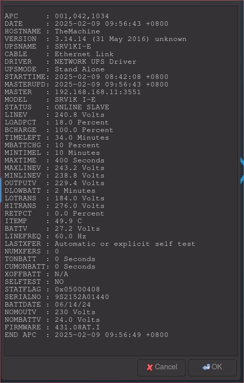

# UPS Waybar Module

This Waybar module provides a live battery status of both local and network enabled UPS
Dependancies: yad, apcupsd

## Features

- **Live remaining battery in minutes display**: Shows real-time remaining battery of the UPS.
 

- **UPS Information**: Clicking on the widget displays a popup with all the UPS information.
  

To install:

Make sure you have yad installed and apcupsd installed and configured to comunicate with your UPS 

Clone the repository / download the zip.

Copy the .sh files to you ~/.config/hypr/scripts folder

Add the example module to your config.jsonc

Add the example style to you style.css
